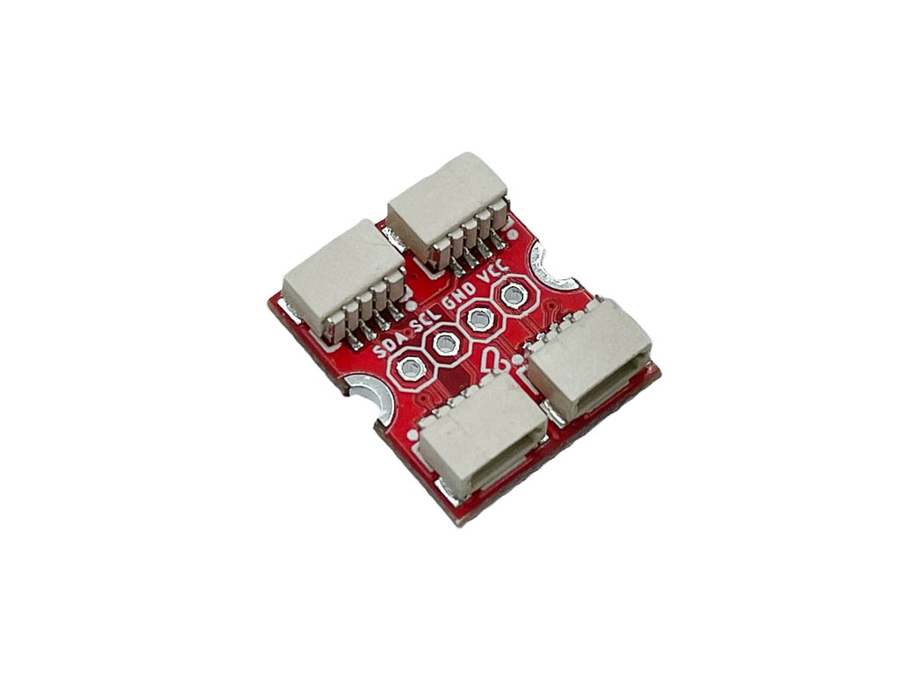

# LaskaKit μŠup 4x na DIP adaptér

Rozbočovač I2C sběrnice s konektory μŠup. Jedním μŠup kabelem ho připojíš k řídicí desce a na zbylé tři konektory zapojíš další čidla nebo moduly s μŠup, Qwiic nebo STEMMA QT. Další zařízení můžeš připojit přes kolíkovou lištu s roztečí 2,54 mm. Všechny konektory jsou propojené paralelně, takže každé zařízení na sběrnici musí mít jinou I2C adresu.

## Specifikace

- **Konektory:** 4× μŠup (JST-SH 4-pin, rozteč 1 mm, se zámkem)
- **Kolíková lišta:** 4 piny, rozteč 2,54 mm – SDA, SCL, GND, VCC
- **Zapojení μŠup:** 1 – GND, 2 – VCC (3,3 V), 3 – SDA, 4 – SCL
- **Kompatibilita:** μŠup, SparkFun Qwiic, Adafruit STEMMA QT
- **Rozměry PCB:** 17,8 × 15,2 × 1,6 mm
- **Montážní otvory:** 2× Ø 2,5 mm

## Vhodné moduly a desky s μŠup

- [LaskaKit SCD41 Senzor CO2](https://www.laskakit.cz/laskakit-scd41-senzor-co2--teploty-a-vlhkosti-vzduchu/)
- [LaskaKit SHT40 Senzor teploty a vlhkosti vzduchu](https://www.laskakit.cz/laskakit-sht40-senzor-teploty-a-vlhkosti-vzduchu/)
- [LaskaKit BME280 Senzor tlaku, teploty a vlhkosti vzduchu](https://www.laskakit.cz/arduino-senzor-tlaku--teploty-a-vlhkosti-bme280/)
- [LaskaKit ESP32-LPKit](https://www.laskakit.cz/laskakit-esp32-lpkit-pcb-antenna/)
- [LaskaKit ESP-VINDRIKTNING ESP-32 I2C](https://www.laskakit.cz/laskakit-esp-vindriktning-esp-32-i2c/)
- [LaskaKit Meteo Mini](https://www.laskakit.cz/laskakit-meteo-mini/)

## Propojovací kabely

- [μŠup, STEMMA QT, Qwiic JST-SH 4-pin kabel – 10 cm](https://www.laskakit.cz/--sup--stemma-qt--qwiic-jst-sh-4-pin-kabel-10cm/)
- [μŠup, STEMMA QT, Qwiic JST-SH 4-pin kabel – dupont samice](https://www.laskakit.cz/--sup--stemma-qt--qwiic-jst-sh-4-pin-kabel-dupont-samice/)
- další v sekci [Propojovací kabely](https://www.laskakit.cz/vodice/)

## Soubory

- [Schéma (PDF)](HW/uSup_4x.pdf)
- [Výrobní data – Gerber, BOM, CPL](Production/)
- [3D model (STEP)](3D/)

## Adaptér koupíš na https://www.laskakit.cz/laskakit-sup-4x-na-dip-adapter/
