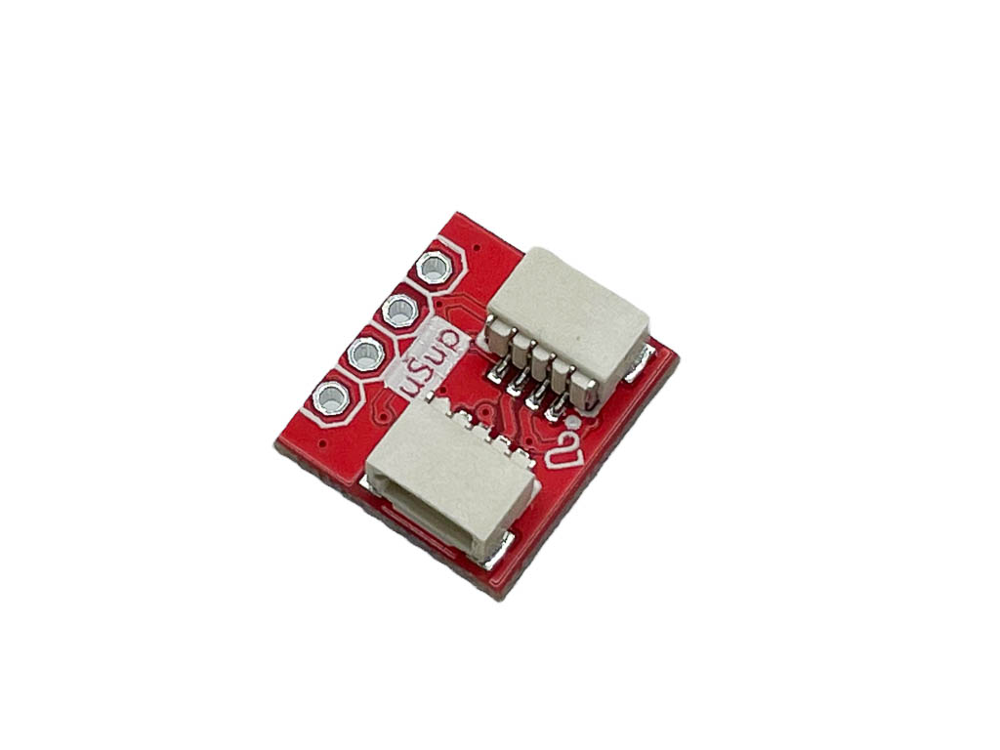
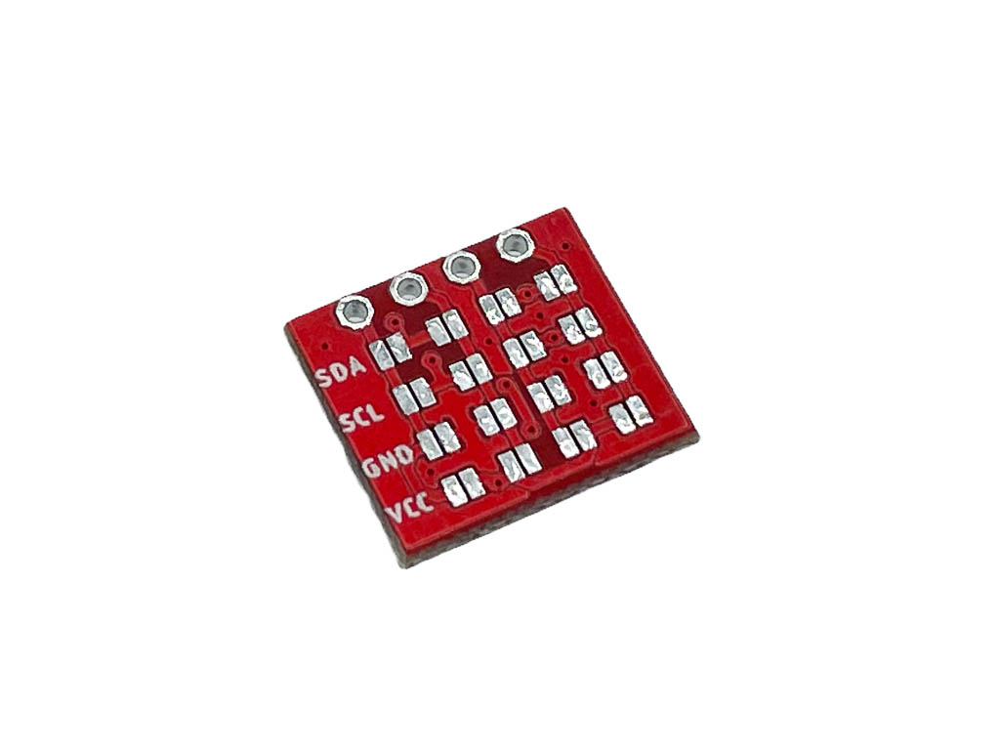

# LaskaKit μŠup na DIP adaptér

Přidej μŠup na čidlo, displej nebo cokoliv jiného s I2C. Adaptér převádí μŠup na kolíkovou lištu s roztečí 2,54 mm, kterou připájíš k modulu bez μŠup konektoru – například k OLED displeji. Pořadí pinů na liště si nastavíš propájením pájecích mostů na zadní straně desky, takže adaptér poslouží i pro moduly s nestandardním pinoutem. Druhý μŠup konektor umožní připojit další zařízení dál po sběrnici.

## Specifikace

- **Konektory:** 2× μŠup (JST-SH 4-pin, rozteč 1 mm, se zámkem), zapojené paralelně
- **Kolíková lišta:** 4 piny, rozteč 2,54 mm (popisky SDA, SCL, GND, VCC)
- **Nastavení pinoutu:** pájecí mosty na zadní straně – každý signál μŠup lze přivést na libovolný pin lišty
- **Zapojení μŠup:** 1 – GND, 2 – VCC (3,3 V), 3 – SDA, 4 – SCL
- **Kompatibilita:** μŠup, SparkFun Qwiic, Adafruit STEMMA QT
- **Rozměry PCB:** 14,0 × 12,4 × 1,6 mm

Displej ani kolíková lišta nejsou součástí balení.

## Vhodné moduly a desky s μŠup

- [LaskaKit SCD41 Senzor CO2](https://www.laskakit.cz/laskakit-scd41-senzor-co2--teploty-a-vlhkosti-vzduchu/)
- [LaskaKit SHT40 Senzor teploty a vlhkosti vzduchu](https://www.laskakit.cz/laskakit-sht40-senzor-teploty-a-vlhkosti-vzduchu/)
- [LaskaKit ESP32-LPKit](https://www.laskakit.cz/laskakit-esp32-lpkit-pcb-antenna/)
- [LaskaKit ESP-VINDRIKTNING ESP-32 I2C](https://www.laskakit.cz/laskakit-esp-vindriktning-esp-32-i2c/)

## Propojovací kabely

- [μŠup, STEMMA QT, Qwiic JST-SH 4-pin kabel – 10 cm](https://www.laskakit.cz/--sup--stemma-qt--qwiic-jst-sh-4-pin-kabel-10cm/)
- [μŠup, STEMMA QT, Qwiic JST-SH 4-pin kabel – dupont samice](https://www.laskakit.cz/--sup--stemma-qt--qwiic-jst-sh-4-pin-kabel-dupont-samice/)
- další v sekci [Propojovací kabely](https://www.laskakit.cz/vodice/)

## Soubory

- [Schéma (PDF)](HW/uSup-DIP.pdf)
- [Výrobní data – Gerber, BOM, CPL](Production/)
- [3D model (STEP)](3D/)

## Adaptér koupíš na https://www.laskakit.cz/laskakit-sup-na-dip-adapter/
