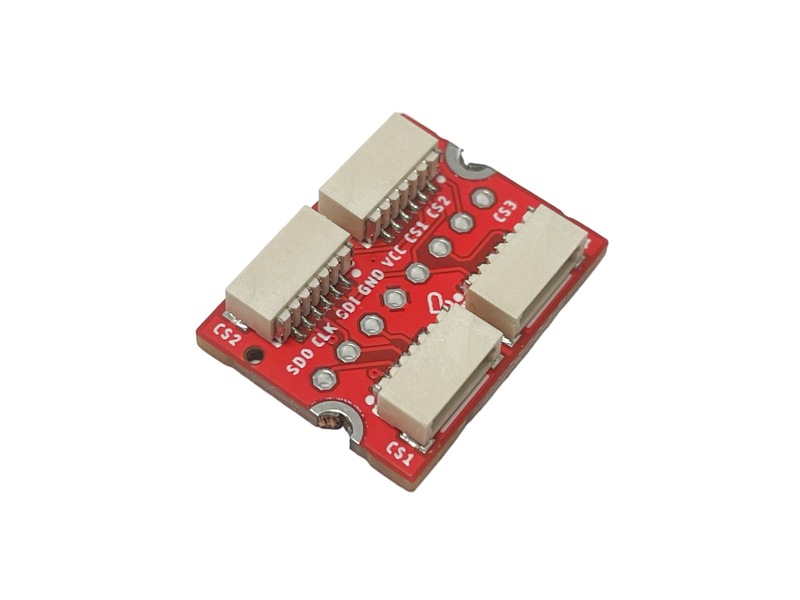

# LaskaKit μŠup-SPI 4x na DIP adaptér

Potřebuješ více senzorů nebo displejů s rozhraním SPI? Adaptér rozbočí jeden konektor μŠup-SPI z řídicí desky na další tři zařízení, například displej a čidla. Linky SDO, CLK, SDI a napájení jsou společné, každé zařízení ale musí mít vlastní CS (chip select) – podle něj pozná, že řídicí deska komunikuje právě s ním.

## Jak zapojit CS

- Dva konektory sdílejí **CS1** – do jednoho zapoj řídicí desku (její CS z μŠup-SPI), do druhého první zařízení.
- Zbylé dva konektory mají vlastní **CS2** a **CS3**, které jsou vyvedené na kolíkovou lištu. Připoj je na volné GPIO řídicí desky.
- Všechny signály jsou vyvedené i na kolíkovou lištu, takže adaptér zapojíš také do nepájivého pole nebo k desce bez μŠup-SPI.

## Specifikace

- **Konektory:** 4× μŠup-SPI (JST-SH 6-pin, rozteč 1 mm, se zámkem)
- **Zapojení μŠup-SPI:** 1 – GND, 2 – VCC (3,3 V), 3 – SDO, 4 – CLK, 5 – SDI, 6 – CS
- **Kolíková lišta:** 8 pinů, rozteč 2,54 mm – SDO, CLK, SDI, GND, VCC, CS1, CS2, CS3
- **Rozměry PCB:** 22,9 × 17,8 × 1,6 mm
- **Montážní otvory:** 2× Ø 2,5 mm
- **Obsah balení:** adaptér + 8pinová kolíková lišta

## Propojovací kabely μŠup-SPI

- [μŠup-SPI JST-SH 6-pin kabel – 5 cm](https://www.laskakit.cz/--sup-spi-jst-sh-6-pin-kabel-5cm/)
- [μŠup-SPI JST-SH 6-pin kabel – 10 cm](https://www.laskakit.cz/--sup-spi-jst-sh-6-pin-kabel-10cm/)
- [μŠup-SPI JST-SH 6-pin kabel – 20 cm](https://www.laskakit.cz/--sup-spi-jst-sh-6-pin-kabel-20cm/)
- [μŠup-SPI JST-SH 6-pin kabel – dupont samice](https://www.laskakit.cz/--sup-spi-jst-sh-6-pin-kabel-dupont-samice/)
- [μŠup-SPI JST-SH 6-pin kabel – dupont samec](https://www.laskakit.cz/--sup-spi-jst-sh-6-pin-kabel-dupont-samec/)

## Soubory

- [Schéma (PDF)](HW/uSup_SPI_4x.pdf)
- [Výrobní data – Gerber, BOM, CPL](Production/)
- [3D model (STEP)](3D/)

## Adaptér koupíš na https://www.laskakit.cz/laskakit-sup-spi-4x-na-dip-adapter/
