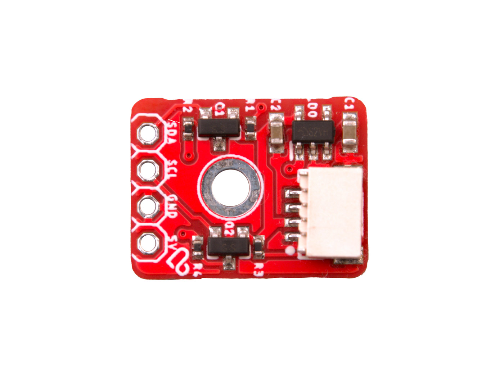

# LaskaKit logic level converter I2C 5V to μŠup 3.3V

A tiny board that lets you connect 3.3 V sensors and modules with a μŠup connector to controller boards with 5 V logic, such as Arduino Uno or Arduino Mega. **The pin header on the 5 V side goes to the controller board, the μŠup connector on the 3.3 V side goes to the sensor.** Two BSS138 MOSFETs handle bidirectional level shifting on SDA and SCL, and an ME6211C33 regulator powers the sensor with 3.3 V derived from 5 V.

If your controller board already uses 3.3 V logic (ESP32, ESP8266 etc.), you don't need the converter – a [μŠup to female dupont cable](https://www.laskakit.cz/en/--sup--stemma-qt--qwiic-jst-sh-4-pin-kabel-dupont-samice/) is enough.

## Specifications

- **Function:** bidirectional I2C logic level converter 5 V ↔ 3.3 V
- **Level shifting:** 2× BSS138 MOSFET, 10 kΩ pull-up resistors on both sides (SDA and SCL)
- **Power:**
  - **Input (5 V side):** 5 V from the controller board
  - **Sensor supply (3.3 V side):** 3.3 V from ME6211C33 LDO, max. 500 mA
- **Connections:**
  - **5 V side (controller):** 4-pin header, 2.54 mm pitch – SDA, SCL, GND, 5V
  - **3.3 V side (sensor/module):** μŠup (JST-SH 4-pin, 1 mm pitch, locking) – 1 GND, 2 VCC 3.3 V, 3 SDA, 4 SCL
- **Connector compatibility:** μŠup, SparkFun Qwiic, Adafruit STEMMA QT
- **PCB size:** 12.7 × 16.5 × 1.6 mm
- **Mounting hole:** 1× Ø 2.5 mm

## Files

- [Schematic (PDF)](HW/uSUP_logic_level_adapter.pdf)
- [Manufacturing data – Gerber, BOM, CPL](Production/)
- [3D model (STEP)](3D/)
- [Version history](Version.md)

## Available at https://www.laskakit.cz/en/laskakit-prevodnik-logickych-urovni-i2c-5v-na-sup-3-3v/
